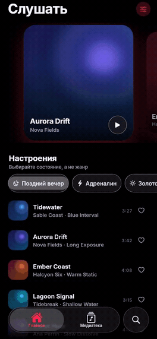
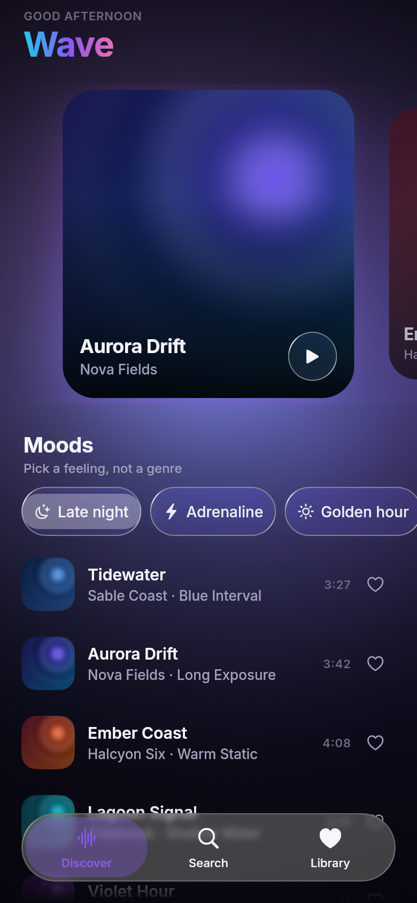
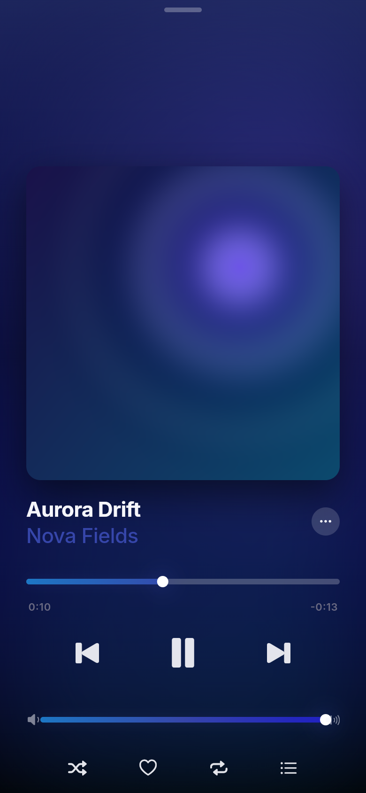
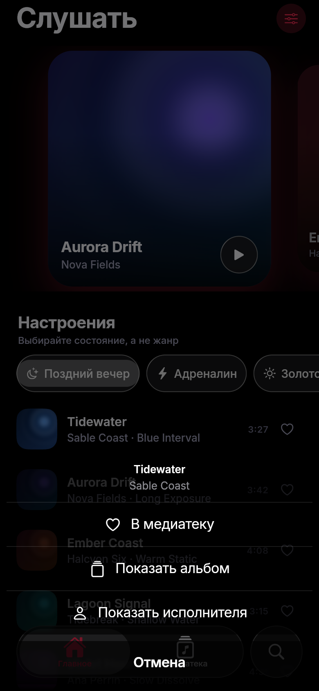
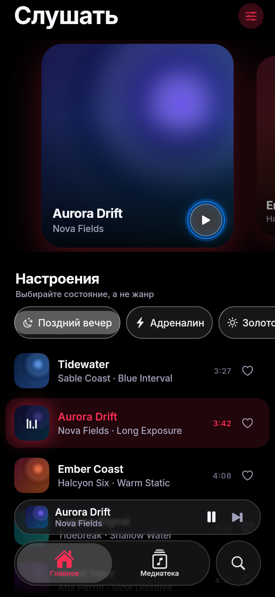
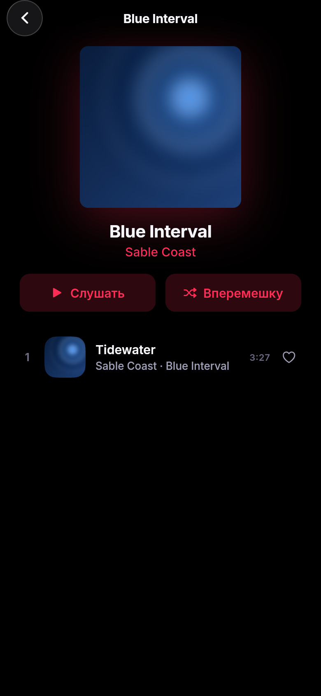
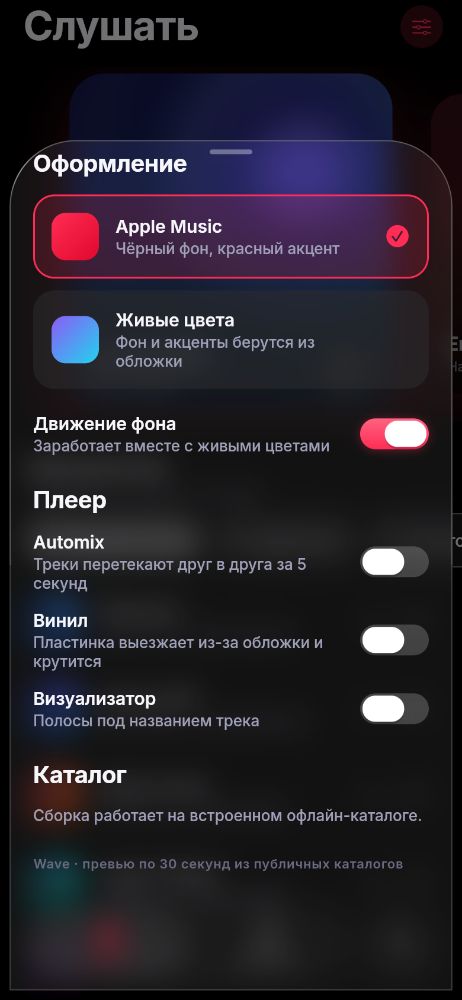

<div align="center">

# 🌊 Wave

**Музыкальный плеер на Flutter, собранный по дизайну Apple Music на компонентах iOS 26 Liquid Glass.**

Реальные каталоги (Apple/iTunes и Deezer), 30-секундные превью, управление
из шторки и с экрана блокировки — и опциональный режим «живых цветов»,
где весь интерфейс красится от обложки трека.

[](https://github.com/TemaSil/wave-music-player/actions/workflows/ci.yml)
[](https://flutter.dev)
[](https://pub.dev/packages/liquid_glass_widgets)
[](#сборка)
[](LICENSE)



</div>

---

## ⚡️ Быстрые ссылки

| | |
|---|---|
| 📦 **Скачать APK** | [**Последний релиз →**](https://github.com/TemaSil/wave-music-player/releases/latest) — `wave-arm64-v8a.apk` для большинства современных телефонов, `wave-universal.apk` — если не уверены |
| 🧪 **Сборка с любого коммита** | [Actions → CI → артефакт `wave-apk`](https://github.com/TemaSil/wave-music-player/actions/workflows/ci.yml) (нужен вход в GitHub, хранится 30 дней) |
| 🌐 **Попробовать в браузере** | [temasil.github.io/wave-music-player](https://temasil.github.io/wave-music-player/) — публикуется из ветки `main` <sup>*</sup> |
| 📱 **Собрать самому** | [Инструкции ниже](#сборка) |

> <sup>*</sup> Чтобы страница заработала, в настройках репозитория нужно один раз включить
> **Settings → Pages → Source: GitHub Actions**. Деплой идёт только с `main`.

> **Про подпись APK.** Релизные APK подписаны отладочным ключом Flutter по умолчанию —
> этого достаточно, чтобы поставить и запустить, но Android покажет предупреждение об
> установке из неизвестного источника. Для публикации в Play Store нужен свой keystore.

---

## 📸 Скриншоты

<table>
<tr>
<td align="center"><br><sub><b>Слушать</b><br>чарты и подборки</sub></td>
<td align="center"><br><sub><b>Now Playing</b><br>винил, визуализатор, liquid-перемотка</sub></td>
<td align="center"><br><sub><b>Действия</b><br>нативный action sheet</sub></td>
</tr>
<tr>
<td align="center"><br><sub><b>Мини-плеер</b><br><code>tabViewBottomAccessory</code></sub></td>
<td align="center"><br><sub><b>Альбом</b><br>и страница исполнителя</sub></td>
<td align="center"><br><sub><b>Настройки</b><br>оформление, Automix, эффекты</sub></td>
</tr>
</table>

<sub>Скриншоты и GIF сняты автоматически из веб-сборки — см. <a href="#инструменты">Инструменты</a>.
В них используется офлайн-каталог, поэтому обложки и названия здесь демонстрационные.</sub>

---

## ✨ Что внутри

### Оформление — два режима
| | |
|---|---|
| **Apple Music** (по умолчанию) | Чистый чёрный фон, красный акцент `#FF2D55`, стекло только на навигации — значения взяты из эталонного `apple_music_demo.dart`, который идёт с библиотекой |
| **Живые цвета** | Дрейфующее цветовое поле и акценты, вытянутые из обложки текущего трека |

Переключается в настройках (иконка справа от заголовка), выбор сохраняется.
Экран Now Playing красится от обложки в обоих режимах — как в настоящем Apple Music.

Там же отдельными переключателями — **винил** и **визуализатор**: это выдумка
Wave, которой в Apple Music нет, поэтому по умолчанию они выключены.

### Плеер
- Очередь, перемотка, громкость, следующий/предыдущий, шаффл, повтор.
- **Automix** — треки перетекают друг в друга за 5 секунд вместо резкой склейки.
  Это звуковая половина того, что в iOS 26 называется Automix; подбора темпа и
  тональности здесь нет — он требует анализа аудио, чего проект не делает.
- **Альбом и исполнитель** — из «•••» на Now Playing или долгим нажатием на
  любую строку списка; открывается нативный action sheet.
- **Управление из шторки и с экрана блокировки**, воспроизведение в фоне,
  кнопки на гарнитуре — через `just_audio_background`.
- Мини-плеер живёт в слоте `tabViewBottomAccessory` таб-бара. При скролле бар
  сжимается, и пилюля переезжает внутрь него — ровно как `.inline` в iOS 26.
- Свайп вверх по мини-плееру или тап — раскрывается полноэкранный Now Playing;
  свайп вниз по нему — закрывается.
- Лайки сохраняются локально (`shared_preferences`), переживают перезапуск.

### Каталоги
| Источник | Ключ нужен? | Что даёт |
|---|---|---|
| **Apple / iTunes Search API** | нет | поиск, реальные чарты «most played», обложки до 600×600, превью 30 с |
| **Deezer API** | нет | альтернативный поиск и чарты, тоже превью 30 с |
| **Офлайн-демо** | — | встроенный каталог из `assets/demo/` для скриншотов, CI и веб-демо |

Переключатель источника — прямо на экране поиска.

### Цвет из обложки
Своя реализация извлечения палитры (`lib/data/palette_service.dart`): обложка декодируется,
пиксели раскладываются по 24 корзинам оттенка со взвешиванием по насыщенности, три самых
«весомых» и различимых оттенка становятся палитрой трека. Под неё подстраивается фон,
визуализатор, перемотка, свечение, акценты таб-бара и даже градиент заголовка «Wave».

---

## 🎬 Анимации

То, ради чего всё затевалось. Ничего из этого не пакет — всё написано руками,
на `CustomPainter`, `Ticker` и явных кривых.

| Анимация | Где | Как сделано |
|---|---|---|
| **Aurora** — дышащий цветной фон | режим «живые цвета» | 4 радиальных пятна по несоизмеримым синусоидам, аддитивное смешивание; амплитуда и скорость растут, когда играет музыка; движение отключается в настройках — `lib/ui/widgets/aurora_background.dart` |
| **Сжатие таб-бара** | оболочка | `GlassTabBar.searchable` с `isSearchActive`: бар пружинно схлопывается в три капсулы при скролле и раскрывается обратно |
| **Винил** | Now Playing | пластинка выезжает из-за обложки и раскручивается; угол интегрируется вручную на `Ticker`, чтобы скорость плавно гасла при паузе с любого места оборота — `vinyl_artwork.dart` |
| **Визуализатор** | Now Playing | 44 полосы из трёх слоёв синусоид + огибающая по краям; на паузе амплитуда плавно уходит в ноль — `wave_visualizer.dart` |
| **Liquid-перемотка** | Now Playing | при захвате дорожка распухает, бегунок надувается в светящуюся каплю, под заливкой зажигается blur-свечение — `liquid_seek_bar.dart` |
| **Переход мини → полный** | шелл → Now Playing | `Hero` на обложке + собственный `PageRouteBuilder` (fade + подъём + масштаб) |
| **Лайк** | все списки | сердце проскакивает за целевой масштаб и выбрасывает кольцо искр — `like_button.dart` |
| **Появление списков** | все списки | каскад: каждая строка всплывает со сдвигом, задержка ограничена сверху — `entrance.dart` |
| **Бегущая строка** | мини-плеер, Now Playing | текст едет, только если не влезает; края растворяются через `ShaderMask` — `marquee_text.dart` |
| **Эквалайзер в строке** | все списки | 4 полосы с разными фазами вместо иконки «сейчас играет» — `equalizer_bars.dart` |
| **Параллакс карусели** | Discover | карточки масштабируются и гаснут по удалению от центра, обложка внутри едет против свайпа |
| **Смена палитры** | везде | `WavePaletteTween` — весь экран перетекает в цвета новой обложки за 900 мс |
| **Сжатие обложки** | Now Playing | на паузе обложка уменьшается до 82% — главный сигнал остановки в Apple Music |

## 🧊 Компоненты Liquid Glass

Из [`liquid_glass_widgets`](https://pub.dev/packages/liquid_glass_widgets) используются:
`GlassScaffold`, `GlassTabBar.bottom` (с `bottomAccessory`), `GlassContainer`, `GlassCard`,
`GlassButton`, `GlassIconButton`, `GlassChip`, `GlassSwitch`, `GlassSegmentedControl`,
`GlassListTile`, `GlassModalSheet`, `GlassProgressIndicator`, `LiquidGlassSettings`,
`LiquidRoundedSuperellipse`, `LiquidRoundedRectangle`,
`GlassTabBarAccessoryPlacementScope`.

Ключевые вещи, без которых «почти iOS 26» не превращается в iOS 26:
`brightnessResolver` (без него в тёмной теме пропадают канты и тени),
`blur: 2` при `thickness: 30` и `fresnelStrength: 0` (сильное размытие делает
стекло мутным, а не стеклянным), стекло только на навигации, и SF Pro —
на Android и вебе подменяется на Inter, иначе весь интерфейс уезжает в Roboto.

Стекло настраивается на уровне приложения через `GlassThemeData.simple(...)` и точечно
через `LiquidGlassSettings` — например, мини-плеер подкрашивается цветом текущей обложки.

---

## 🏗 Архитектура

```
lib/
├── main.dart                    точка входа: инициализация стекла, аудиосессии, темы
├── core/
│   ├── wave_theme.dart          цвета, палитра обложки, стекло Apple Music, типографика
│   ├── appearance.dart          выбор оформления, сохраняется на устройстве
│   └── wave_scope.dart          сервисы + AmbienceNotifier (палитра текущего трека)
├── data/
│   ├── track.dart               модель трека, парсинг обеих схем API, JSON-сериализация
│   ├── music_api.dart           MusicSource: iTunes, Deezer, MusicRepository, «настроения»
│   ├── demo_source.dart         офлайн-каталог на ассетах
│   ├── palette_service.dart     извлечение палитры из обложки (без зависимостей)
│   └── favorites_repository.dart лайки в shared_preferences
├── audio/
│   └── player_service.dart      обёртка над just_audio: очередь, скраб, шаффл, повтор
└── ui/
    ├── root_shell.dart          GlassScaffold + таб-бар + мини-плеер + свайп между вкладками
    ├── screens/                 discover / search / library / now_playing / settings
    └── widgets/                 всё из таблицы анимаций выше
```

Состояние — обычные `ChangeNotifier` + `InheritedWidget`. Приложение — одна оболочка и один
плеер; пакет для управления состоянием здесь добавил бы только слой косвенности.

---

## 🚀 Запуск

Нужен **Flutter 3.41+** (пакет стекла требует именно эту версию; в CI закреплён 3.47.3).

```bash
git clone https://github.com/TemaSil/wave-music-player.git
cd wave-music-player
flutter pub get
flutter run            # реальные каталоги: iTunes + Deezer
```

Офлайн, без сети и без API:

```bash
flutter run --dart-define=WAVE_DEMO=true
```

### Сборка

```bash
# Android
flutter build apk --release --split-per-abi   # по одному APK на ABI
flutter build apk --release                   # универсальный APK

# iOS (нужен macOS и Xcode)
flutter build ios --release

# Web — в браузере живые API недоступны из-за CORS, поэтому демо-каталог
flutter build web --release --no-web-resources-cdn --dart-define=WAVE_DEMO=true
```

### Тесты и проверки

```bash
flutter analyze
flutter test
dart format --output=none --set-exit-if-changed lib test tool
```

Ровно это же гоняет CI на каждый push.

---

## 🤖 CI

[`.github/workflows/ci.yml`](.github/workflows/ci.yml):

1. **verify** — форматирование, `flutter analyze`, `flutter test`.
2. **android** — собирает APK (4 штуки), кладёт в артефакты сборки; на теге `v*`
   дополнительно прикрепляет их к GitHub Release.
3. **web** — собирает веб-версию с демо-каталогом.
4. **pages** — публикует её на GitHub Pages (только с `main`).

Выпустить релиз с APK — любым из двух способов:

```bash
git tag v1.0.0 && git push origin v1.0.0
```

или без прав на пуш тегов: **Actions → CI → Run workflow**, в поле `release_tag`
указать `v1.0.0`. Тег и релиз создадутся сами, APK прикрепятся.

---

## 🛠 Инструменты

Скриншоты и GIF в этом README не рисовались руками — они снимаются скриптами
с настоящей сборки, так что их можно пересобрать в любой момент:

```bash
flutter build web --release --no-web-resources-cdn \
  --dart-define=WAVE_DEMO=true --output=build/web-demo

node tool/capture_screenshots.mjs   # → docs/screenshots/*.png
node tool/record_demo.mjs           # → docs/demo.gif (нужен ffmpeg)
```

Ассеты демо-каталога тоже генерируются, без сторонних библиотек:

```bash
python3 tool/generate_demo_assets.py   # обложки и превью в assets/demo/
```

---

## ⚡️ Производительность

Несколько вещей, которые стоили заметно дороже, чем выглядели:

- **Позиция воспроизведения больше не идёт через `ChangeNotifier`.** Поток
  позиции срабатывает десятки раз в секунду, и каждый экран, подписанный на
  плеер, перерисовывался с этой частотой — целиком, со всеми строками. Теперь
  позиция, буфер и громкость живут в отдельных `ValueNotifier`, а на них
  подписаны только полоса перемотки и часы.
- **Свечение визуализатора** было `MaskFilter.blur` на каждой из 44 полос —
  44 размытия за кадр. Заменено на один размытый слой.
- **Эквалайзер в строке** крутил `AnimationController` в каждой строке списка,
  играет она или нет. Теперь тикер запускается только у текущей строки.
- **Бегущая строка** измеряла текст и планировала колбэк на каждой сборке;
  теперь — только при смене текста, ширины или стиля.
- **Результаты поиска** строились целиком (до 50 строк) перед первым кадром;
  переведены на ленивый `SliverList.builder`.

## ⚠️ Что стоит знать

- **Превью — 30 секунд.** И iTunes, и Deezer отдают только фрагменты; полных треков
  у бесплатных публичных API нет. Прогресс-бар показывает длину именно фрагмента.
- **Web и CORS.** `itunes.apple.com` и `api.deezer.com` не присылают
  `Access-Control-Allow-Origin`, поэтому из браузера к ним не достучаться. Веб-сборка
  работает на демо-каталоге; для «настоящего» веба понадобится свой прокси.
- **Стекло на вебе упрощённое.** Пакет использует полноценный Impeller-шейдер
  только на iOS/macOS/Android; в браузере работает облегчённый 2D-вариант.
  Скриншоты сняты с веб-сборки, так что на реальном iPhone преломление заметно
  сильнее, чем на картинках.
- **Ассеты демо** (~1.4 МБ) попадают и в обычный APK. Это цена того, что демо-режим
  включается одним флагом, без отдельного флейвора сборки.

---

## 📄 Лицензия

MIT — см. [LICENSE](LICENSE).

Каталоги принадлежат их владельцам: Wave только показывает публичные метаданные и
официальные превью Apple и Deezer и ничего не скачивает и не кэширует на диск.

---

<details>
<summary><b>English summary</b></summary>

Wave is a Flutter music player built around Apple's iOS 26 Liquid Glass design language
via [`liquid_glass_widgets`](https://pub.dev/packages/liquid_glass_widgets), with
hand-written animations: an additive aurora background that breathes with playback, a
vinyl that spins out from behind the cover, a synthesised bar visualiser, a liquid seek
bar, hero transitions between the mini player and the full player, and a colour palette
extracted from the current artwork that retints the whole UI.

It plays 30-second previews from two key-free public catalogues — the **iTunes Search
API** (plus Apple's RSS charts) and the **Deezer API** — and ships an offline demo
catalogue used for the screenshots, the hosted web build and CI.

- **Download the APK:** [latest release](https://github.com/TemaSil/wave-music-player/releases/latest)
- **Try it in a browser:** [temasil.github.io/wave-music-player](https://temasil.github.io/wave-music-player/)
- **Run it:** `flutter pub get && flutter run` (Flutter 3.41+), or
  `flutter run --dart-define=WAVE_DEMO=true` for the offline catalogue.

</details>
